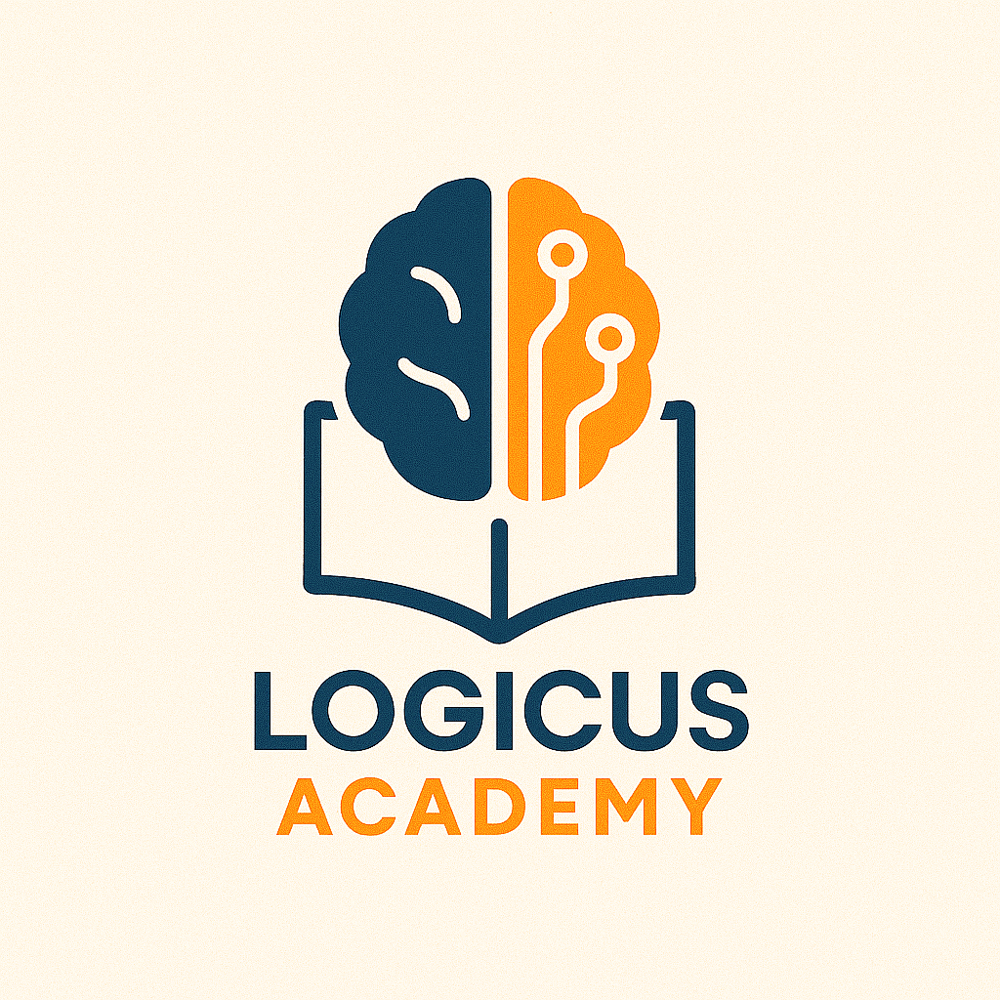

# Logicus Academy

    

Belajar Masuk Akal, Hasil Maksimal!

[Click to view website →](https://msha.ke/sabirin)

---

Logicus Academy adalah tempat belajar modern yang menggabungkan logika, strategi, dan pendekatan personal untuk membantu siswa Indonesia memahami pelajaran dengan cara yang lebih efektif dan menyenangkan. Kami percaya bahwa setiap anak punya potensi luar biasa—tugas kami adalah mengaktifkannya.

### **Visi Logicus Academy**  
**"Menjadi Lembaga Pendidikan yang Membangun Generasi Berpikir Logis, Kreatif, dan Berdaya Saing Global."**  

### **Misi Logicus Academy**  
**"Mengubah Cara Belajar Siswa Indonesia dengan Pendekatan Masuk Akal, Hasil Maksimal!"**  

---

### **Konsep Pembelajaran: "LOGIC! LEARN! LEAD!"**  
**(Berpikir Logis → Paham Mendalam → Jadi Juara)**  

#### **1. LOGIC! (AKU TAHU ‘MENGAPA’)**  
Fokus pada pemahaman logika dasar, bukan hafalan.  
- **Pembelajaran berbasis konsep**: Setiap materi diajarkan dengan penjelasan sebab-akibat.  
- **Metode analogi & cerita**: Kompleksitas pelajaran diubah jadi analogi sehari-hari yang mudah dicerna.  
- **Latihan berpikir kritis**: Siswa dilatih mengurai masalah langkah demi langkah.  

#### **2. LEARN! (AKU BISA ‘MENYELESAIKAN’)**  
Belajar dengan strategi yang terukur dan aplikatif.  
- **Kurikulum adaptif**: Materi disesuaikan dengan gaya belajar (visual, auditori, kinestetik).  
- **Bank soal berbasis data**: Latihan soal dipilih berdasarkan tren UTBK/Kurikulum Merdeka + analisis weakness siswa.  
- **Teknik ‘smart drilling’**: Latihan terstruktur untuk meningkatkan kecepatan & ketepatan.  

#### **3. LEAD! (AKU SIAP ‘JUARA’)**  
Mempersiapkan siswa tidak hanya pintar, tapi juga percaya diri.  
- **Pelatihan mindset**: Motivasi & manajemen stres saat ujian.  
- **Proyek aplikatif**: Penerapan ilmu dalam kasus nyata (misal: matematika untuk analisis data sederhana).  
- **Komunitas belajar**: Grup diskusi dan mentorship dengan alumni sukses.  

*"Ngerti Dasarnya, Jago Prakteknya!"*

